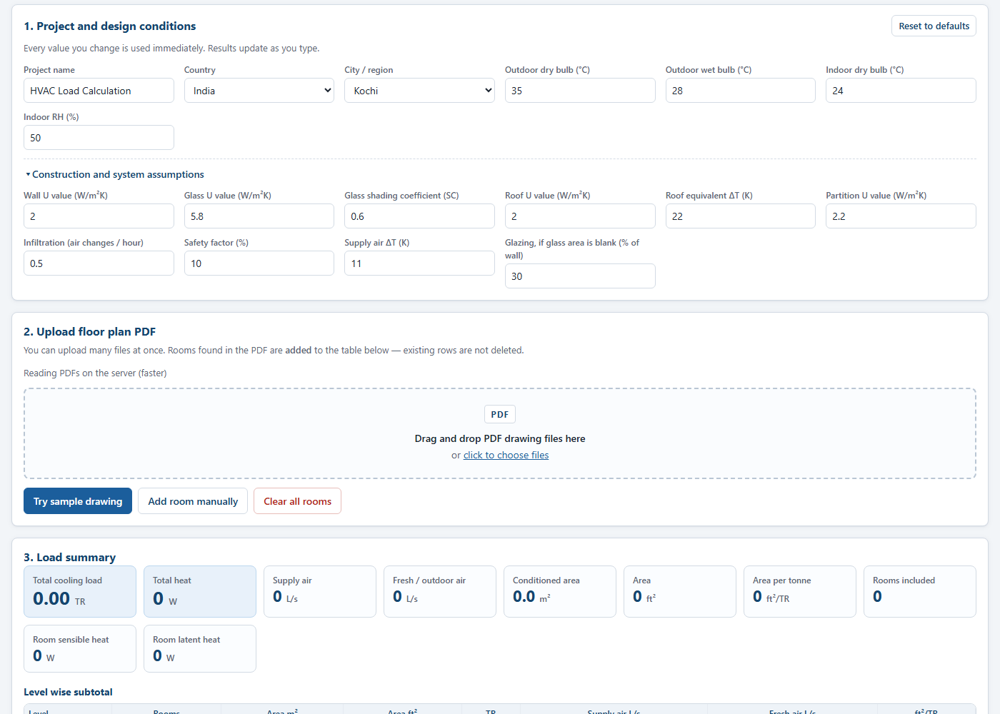
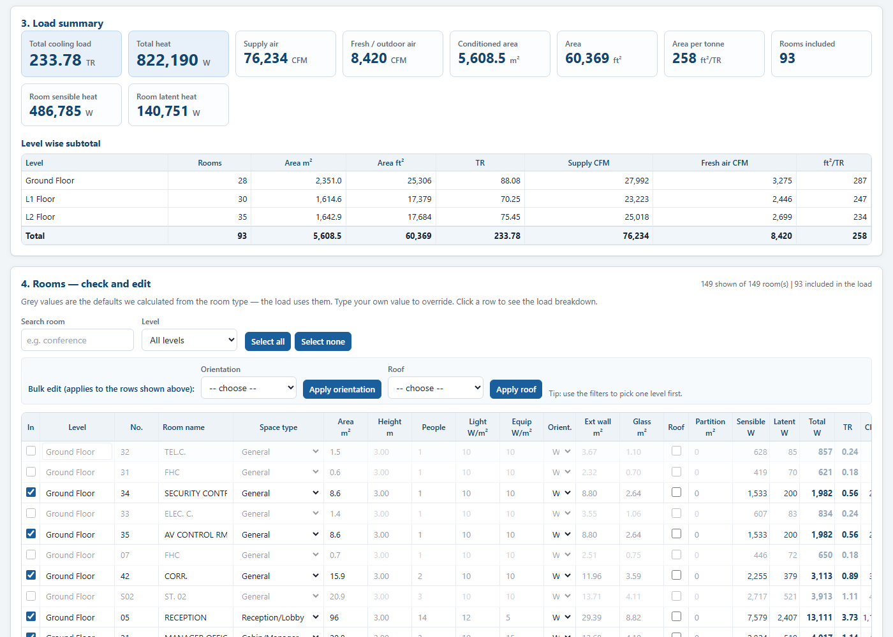
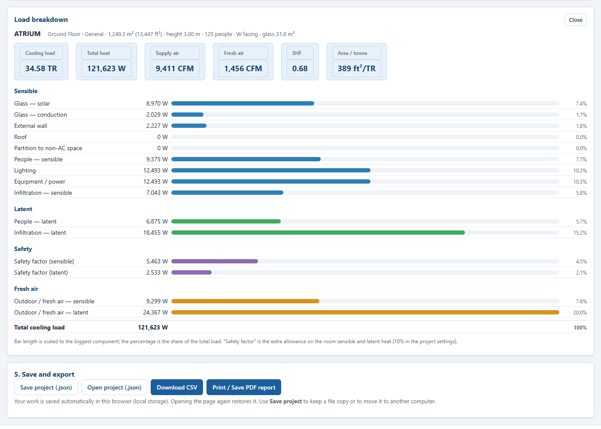

# WebHVAC — user guide

WebHVAC reads the rooms out of an architectural or MEP **floor plan PDF** (or a room schedule
PDF) and estimates the **cooling load** of each room and of the whole building: sensible and
latent heat in watts, tonnes of refrigeration (TR), supply air in CFM, fresh-air CFM and the
ft²/tonne figure. You check and correct the rooms in a table, set the design conditions and the
construction assumptions, then export a CSV or a printable report. Everything runs on your own
computer — nothing is uploaded anywhere on its own, and no login is needed.

The same page also works the other way: type the rooms in by hand, or start from an empty table,
if the PDF cannot be read.

---

## 1. How to open it

There are two copies of the same app.

**A. On your own PC (full version: server reads the PDFs)**

```bash
cd D:/webhvac
npm install          # only the first time
npm start            # starts the server, default port 3000
```

Then open **http://localhost:3000/** in your browser. Use `PORT=8080 npm start` if port 3000 is
busy. Press `Ctrl + C` in the terminal to stop it.

When the page is served by this server, the line under "2. Upload floor plan PDF" says
**"Reading PDFs on the server (faster)"** and the PDF is parsed by Node instead of by your browser.
If the server is not answering, the same page falls back to reading the PDF in the browser by
itself and says so. You never have to choose.

**B. GitHub Pages (static copy, nothing to install)**

The repo `ratul-sraj/hvac` is published with GitHub Pages. The address (something like
`https://<user>.github.io/hvac/`) is shown in the repository under **Settings → Pages**, or in the
output of the "Deploy to GitHub Pages" workflow run. On Pages the PDF is always read inside your
browser — that path works offline too.

For deploying to a real server (Docker, Render, Railway, Fly.io) see [the deploy guide](DEPLOY.md).

---

## 2. Walkthrough — from a PDF to a load sheet

### Step 1 — set the project and the design conditions



Fill in the project name, then pick **Country** and **City / region**. The city fills the outdoor
dry bulb (DB) and wet bulb (WB) from the built-in climate table (Kochi = 35 °C DB / 28 °C WB).
Indoor conditions, the U values, the safety factor and the supply air ΔT sit in the same panel —
see [section 4](#4-design-conditions-and-assumptions) for what each one does.
**Reset to defaults** puts the whole panel back to the values shipped with the app.

Everything recalculates as you type. You do not need to press any "calculate" button.

### Step 2 — upload the drawing

Drag a PDF onto the dashed box (or click it and choose the file). You can select several PDFs at
once — up to 10 files per upload, max 25 MB each. Two buttons help you test:

- **Try sample drawing** loads `tests/samples/headquarters.pdf`, a real 3-page sample building.
- **Add room manually** adds one empty room you can type into.

A progress bar shows the file and the page being read, then a status line reports what happened,
for example `149 room(s) added, 6 looked like duplicates and were skipped`. Parser notes
(duplicate labels, labels without an area, pages with no text) are collected in the
**"parser note(s) — click to read"** box. Read them: they tell you what the reader could not
make sense of.

### Step 3 — check the rooms that were found



The sample building gives **149 rooms** in **3 floors** (Ground Floor, L1 Floor, L2 Floor). In the
table, `93 included in the load` and `149 shown` — the other 56 rows are toilets, shafts, stores,
stairs and similar, which the app sets to *not air conditioned* by itself.

The top of this page is the summary: **total cooling load in TR**, total heat in W, supply air
CFM, fresh-air CFM, conditioned area in m² and ft², area per tonne (ft²/TR), rooms included, room
sensible heat and room latent heat. Under it, the **level-wise subtotal** table shows the same
numbers floor by floor — which is how you normally report a job.

For the sample the totals are: **5,608.5 m² conditioned**, **233.78 TR**, **76,234 CFM supply air**,
**8,420 CFM fresh air**, about **258 ft²/TR**.

### Step 4 — fix the wrong rooms

The reader is not a CAD engine. It reads the text layer of the PDF, so a room name can be a label
like `ATRIUM` or `WORKSTATIONS`, an area can be missing, and a small room can be misread. Work
down the table and correct what is wrong:

- **In** — untick a room to keep it in the list but leave it out of the totals. **Rooms included**
  in the summary tells you how many are counted.
- **Space type** — changes the people, lighting, equipment and fresh-air rates (see section 3).
- **Area, height, people, light, equip, ext wall, glass, roof, partition** — type your own value
  to override. A grey placeholder means *the app is using the calculated default*, so trust the
  drawing and type over it where you know better.
- The **Search room** and **Level** filters, the **Select all / Select none** buttons, and
  **Apply orientation / Apply roof** work on the rows that are shown, so filter first and then
  apply in bulk.
- The **×** at the end of a row deletes the room.

Click any column heading to sort (click again to reverse, a third time to clear) — sorting by TR is
the fastest way to find the rooms that drive the load.

### Step 5 — open one room and look at its breakdown



Click anywhere on a row: the **Load breakdown** panel opens under the table. It shows the room's
cooling load in TR, total heat in W, supply air CFM, fresh-air CFM, SHF and ft²/TR, and then every
heat-gain component in watts with its share of the total:

glass (solar), glass (conduction), external wall, roof, partition, people sensible, lighting,
equipment, infiltration sensible — then people latent, infiltration latent — then the safety
factor, and finally the outdoor/fresh air sensible and latent parts.

This panel is what you show when someone asks *"where does the number come from?"*.

### Step 6 — export

- **Download CSV** (`<project>-cooling-load.csv`) — one row per room with all inputs and results
  (Sensible W, Latent W, Total W, TR, CFM, fresh-air CFM, ft²/TR, SHF), with the project settings
  repeated as `#` comment lines at the top. This is the file you put into Excel.
- **Print / Save PDF report** — opens a formatted report in a new window with the design
  conditions, the assumptions used, the room-wise table, the load summary, the level-wise
  subtotals and the "Important notes" list. Use the **Print / Save as PDF** button in that window
  (A4 landscape) to keep a signed copy.
- **Save project (.json)** and **Open project (.json)** keep a file copy of the rooms and settings,
  so you can move the work to another computer.

Your work is also saved automatically in the browser (local storage), so closing the tab and
opening the page again restores the last table. **Clear all rooms** empties it.

---

## 3. Every editable column

Left-hand columns are inputs (you can change them); right-hand columns are results (the app
fills them).

| Column | What it is | What changing it does |
|---|---|---|
| **In** | Include this room in the load | Unticked = still listed, left out of every total (toilets, shafts, stores) |
| **Level** | Floor name from the drawing (`Ground Floor`, `L1 Floor`, …) | Groups the level-wise subtotal table and the level filter; rooms with no level appear as *Unspecified* |
| **No.** | Room number from the drawing | Label only — nothing is calculated from it |
| **Room name** | Name read from the PDF label | Re-guesses the space type from words in the name (MEETING → Conference, WARD → Patient room, …) unless you set the type yourself |
| **Space type** | One of 13 use types (Office, Conference, Cabin, Reception, Retail, Restaurant, Bedroom, Living, Classroom, Patient room, Server/IT, Gym, General) | Sets m² per person (→ people count), lighting W/m², equipment W/m², sensible/latent W per person and the ASHRAE 62.1 fresh-air rate |
| **Area m²** | Floor area of the room | The biggest single driver: changes people, lighting, equipment, roof, infiltration and the fresh-air area term |
| **Height m** | Room height (default 3.0 m) | Changes the room volume, so infiltration (0.5 ACH) |
| **People** | Number of occupants | People sensible + latent heat and the fresh-air per-person rate. Default = ceil(area ÷ m² per person of the space type) |
| **Light W/m²** | Lighting power density | Lighting load = area × this value |
| **Equip W/m²** | Equipment / power density | Equipment load = area × this value |
| **Orient.** | Which way the exposed façade faces (N, NE, E, SE, S, SW, W, NW) | Peak solar gain through the glass and the wall ETD (west is the worst, north the mildest) |
| **Ext wall m²** | Gross exposed wall area | Wall conduction = (wall − glass) × U wall × ETD. Default = longest room side × height |
| **Glass m²** | Glazing area | Solar gain through glass + glass conduction. Default = 30 % of the exposed wall |
| **Roof** | Tick when the room has an exposed roof / is on the top floor | Adds area × U roof × roof ETD (22 K) |
| **Partition m²** | Wall area shared with a non-air-conditioned space | Partition conduction at U 2.2 W/m²K over (ΔT − 3) |
| **Sensible W** *(result)* | Room sensible heat, safety factor included | — |
| **Latent W** *(result)* | Room latent heat, safety factor included | — |
| **Total W** *(result)* | Sensible + latent for the room | — |
| **TR** *(result)* | Total cooling load of the room in tonnes of refrigeration | — |
| **CFM** *(result)* | Supply air at the supply ΔT | — |
| **ft²/TR** *(result)* | Room area per tonne | — |
| **×** | Delete the room | — |

Shortcuts: `Esc` closes the breakdown panel. Sorting works on every column. The typo-friendly
habit is to filter by level, fix that floor, then move to the next level.

**Space-type defaults used when you leave a column blank** (from `js/calc.js`):

| Space type | m² per person | Light W/m² | Equip W/m² | People W sens. | People W lat. | Fresh air L/s per person | … per m² |
|---|---|---|---|---|---|---|---|
| Office | 10 | 10 | 15 | 75 | 55 | 2.5 | 0.3 |
| Conference/Meeting | 2.5 | 12 | 5 | 75 | 55 | 2.5 | 0.3 |
| Cabin/Manager | 8 | 10 | 15 | 75 | 55 | 2.5 | 0.3 |
| Reception/Lobby | 7 | 12 | 5 | 75 | 55 | 2.5 | 0.3 |
| Retail/Shop | 6 | 20 | 5 | 75 | 55 | 3.8 | 0.6 |
| Restaurant/Dining | 1.5 | 12 | 10 | 80 | 80 | 3.8 | 0.9 |
| Bedroom | 7 | 6 | 5 | 70 | 35 | 2.5 | 0.3 |
| Living/Family | 6 | 8 | 8 | 70 | 45 | 2.5 | 0.3 |
| Classroom | 2 | 10 | 5 | 70 | 45 | 5.0 | 0.6 |
| Patient room/Ward | 8 | 10 | 10 | 70 | 45 | 12 | 0 |
| Server/IT room | 30 | 10 | 300 | 75 | 55 | 2.5 | 0.3 |
| Gym | 5 | 10 | 10 | 210 | 315 | 10 | 0.3 |
| General | 10 | 10 | 10 | 75 | 55 | 2.5 | 0.3 |

---

## 4. Design conditions and assumptions

These are the values the calculation actually uses. They are **typical practice values**, not a
code compliance table: for a real job replace them with the values from the current **ISHRAE**
handbook (or the local building code / the project specification) and from the actual wall, glass
and roof build-ups in the architectural drawing.

### Outdoor and indoor design conditions

| Setting | Default | Meaning / what to change it to |
|---|---|---|
| Country | India | Selects the list of cities. `Custom` lets you type your own DB/WB |
| City / region | Kochi | Fills outdoor DB/WB from `COUNTRIES` in `js/calc.js`, e.g. Kochi 35/28, Chennai 38/28, Delhi 43/24, Bengaluru 34/22 |
| Outdoor dry bulb (°C) | 35 | Summer design DB — verify against ISHRAE for the actual city |
| Outdoor wet bulb (°C) | 28 | Coincident WB. The gap between DB and WB is the **latent** load of the fresh air; a humid place (Kochi 35/28) has much more latent load than a dry one (Delhi 43/24) |
| Indoor dry bulb (°C) | 24 | Room set point |
| Indoor RH (%) | 50 | Room relative humidity → indoor humidity ratio |

### Construction and system assumptions

| Setting | Default | Meaning / what to change it to |
|---|---|---|
| Wall U value (W/m²K) | 2.0 | 230 mm brick, plastered. Use the real build-up: block + insulation, glass curtain wall, etc. |
| Glass U value (W/m²K) | 5.8 | Single clear glass. Double glazing is roughly 2.7–3.0, low-e lower |
| Glass shading coefficient (SC) | 0.6 | Clear glass with internal blinds. Replace with the glass manufacturer's SC/SHGC (÷ 0.87 to get SHGC) and the real shading |
| Roof U value (W/m²K) | 2.0 | RCC slab with waterproofing / weathering course |
| Roof equivalent ΔT, ETD (K) | 22 | Sol-air temperature difference for the roof. Bigger for a dark, unventilated roof |
| Partition U value (W/m²K) | 2.2 | Wall to a non-air-conditioned space |
| Infiltration (air changes/hour) | 0.5 | Leaky envelope, open doors, stack effect — raise it for old or open buildings |
| Safety factor (%) | 10 | Extra allowance added to the room sensible and latent heat (shown separately in the breakdown) |
| Supply air ΔT (K) | 11 | Room air minus supply air temperature; sets the supply CFM = sensible ÷ (1.23 × ΔT) |
| Glazing (% of exposed wall) | 30 | Used **only** when the glass area is blank, to guess the window area |

Two more values are fixed in `js/calc.js` and are not editable in the UI: peak solar gain through
glass (W/m²: N 110, NE 300, E 440, SE 300, S 130, SW 350, W 470, NW 300, H 650) and the wall
sol-air ETD (K: N 7, NE 10, E 12, SE 11, S 9, SW 13, W 15, NW 12) — peak values for about 10°
north latitude, which is where Kerala sits.

### The formulas, in one screen

```
ΔT        = outdoor DB − indoor DB                       (K)
w_out     = humidity ratio from outdoor DB/WB            (kg/kg)
w_in      = humidity ratio from indoor DB/RH             (kg/kg)

SENSIBLE (W)                              LATENT (W)
glass solar  = glass × solar(W/m²) × SC    people     = people × latent W each
glass cond.  = glass × Uglass × ΔT         infiltration = 3010 × infil L/s × (w_out − w_in)
wall         = (extWall − glass) × Uwall × ETD
roof         = area × Uroof × 22           Infiltration air (L/s) = ACH × volume(m³) × 1000 / 3600
partition    = m² × Upart × (ΔT − 3)
people       = people × sensible W each
lighting     = area × W/m²
equipment    = area × W/m²
infiltration = 1.23 × infil L/s × ΔT

ROOM      = (sensible sum × (1 + safety%)) + (latent sum × (1 + safety%))
FRESH AIR = 1.23 × OA L/s × ΔT   (sensible)   +   3010 × OA L/s × (w_out − w_in)   (latent)
TOTAL     = ROOM + FRESH AIR            TR = TOTAL / 3517            CFM = supply L/s × 2.119
SHF       = sensible ÷ (sensible + latent)
```

---

## 5. Troubleshooting

| What you see | What it usually is | What to do |
|---|---|---|
| **No rooms found** (status says 0 rooms added) | The PDF is a **scan** — a photo or a plot with no text layer. WebHVAC reads text only, there is no OCR | Open the PDF and try to select a room name with the mouse. If you cannot select text, nothing can read it. Upload a vector/text PDF exported from AutoCAD/Revit, or upload the **room schedule** sheet, or type the rooms in with **Add room manually** |
| Only some rooms found | Rooms drawn as text on top of the plan are not always tagged with an area; the parser skips labels with no area and says so in the **parser note(s)** box | Read the notes, then add the missing rooms by hand. A room-schedule table page usually parses better than the plan itself |
| A **room name** is wrong or looks like a number (`TEL.C.`, `M. TL.`) | The PDF uses short drafting labels and their room numbers | Click the name cell and type the real name; the space type follows the new name |
| **Area missing** (blank area, 0 m²) | The label had no area in the text layer | Type the area from the drawing. Note the default ext-wall and glass areas are *derived* from the area, so fix the area first |
| **Load too high** | Defaults are conservative for your building: 30 % glazing assumed on the exposed wall, one exposed side, west orientation, roof exposed on the top floor, 0.5 ACH infiltration, 10 % safety | Check the big rooms first (sort by TR): correct the glass area from the glazing schedule, set the real orientation, untick **Roof** on the inner floors, lower infiltration if the façade is tight, and look at equipment W/m² (server rooms) |
| **Load too low** | Wrong city (a dry city gives far less latent load), a big room read as a small area, missing partitions to non-AC spaces, people counts too low for a crowded space (a classroom needs 2 m²/person, not 10) | Check the city, the areas of the biggest rooms, the space type of the crowded rooms, and the partition column for corridors and atria |
| The room table is empty but the summary has numbers, or vice versa | The **Level** filter or the search box is hiding rows; the summary always counts all included rooms | Set the filter back to *All levels* and clear the search box |
| The page says **"Reading PDFs in your browser"** but a server is running | The one-time health check failed (the page was opened as a `file://` page, through GitHub Pages, or the server was started after the page was loaded) | Reload the page. Open it through `http://localhost:3000/`, not by double-clicking `index.html` |
| The server answers with an error and the table is still filled | The server rejects a file over the limit (413) or a PDF it cannot read (400); the app then reads it locally | Read the message, then upload a smaller file. The local reader is slower but works the same |
| `NaN`, `undefined` or an empty column | Almost always an area of 0 or a blank field after an edit | Open the room breakdown — a room with no area has no load — and fill the area in |
| The numbers changed after you closed the tab | The page restores the last work from the browser's local storage; a **CSV/JSON** was not exported | Export the CSV or **Save project (.json)** when you finish a session |

---

## 6. What this tool is **not**

Say this clearly, the same way the printed report does:

- **It is not a design load calculation.** It is a **handbook-level estimate** (simplified
  ASHRAE / Carrier E-20 style: peak solar gain, sol-air ETD values, people/lighting/equipment
  densities, infiltration). A qualified HVAC engineer must check the inputs and the result before
  anything is ordered or issued. For a signed calculation use **HAP, Carrier E-20/System Design
  Loads or Trane TRACE** — or a full manual RTS calculation.
- **No hourly simulation.** It is a peak snapshot at one design hour (peak solar for about 10°
  north latitude). It cannot tell you the load profile of the building, the part-load hours, the
  energy use, or which month the peak really happens.
- **No radiant time series / heat storage over time** in the walls, slab or furniture — the
  storage effect is folded into a single factor, not computed hour by hour.
- **No duct or pipe sizing.** The CFM figure is supply air quantity, not a duct size, and there is
  no duct heat gain, no duct leakage, no fan heat, no chilled water or refrigerant pipe sizing, no
  diffuser selection.
- **No psychrometric chart and no coil selection.** It reports SHF and the humidity ratios it
  used, but it does not plot the process line or select an AHU/FCU coil and its ADP.
- **No equipment selection.** No diversity factor, no redundancy, no part-load, no altitude
  correction, no chiller plant, no VRF selection, no controls.
- **No fresh-air duct, toilet and staircase ventilation design** — those spaces are simply
  excluded from the totals.
- **No CAD/Revit intelligence.** It reads the **text layer** of a PDF. It does not understand
  geometry, room boundaries, room-bounding elements or a Revit model, and it cannot read a Revit
  room schedule directly — print/export the schedule to PDF first.
- **No code compliance.** Fresh-air rates are taken from ASHRAE 62.1 type-of-use values inside the
  app; your project's actual code (ASHRAE 62.1, NBC India, ECBC, local authority) and the project
  specification rule.

---

## 7. Screenshots

| File | What it shows |
|---|---|
| [`img/app-empty.png`](img/app-empty.png) | The calculator before anything is uploaded — project and design conditions, upload panel, empty summary |
| [`img/app-loaded.png`](img/app-loaded.png) | The sample building loaded: summary cards and the floor-wise subtotals above the 149-row room table |
| [`img/app-detail.png`](img/app-detail.png) | The load breakdown panel for one room — every heat-gain component in W with its share |
| [`img/method.png`](img/method.png) | The "Method and assumptions" page |
| [`img/help.png`](img/help.png) | The "Help and FAQ" page |
| [`img/landing.png`](img/landing.png) | The landing page (`index.html`) |

They are produced by `tests/screenshots.mjs` from a running copy of the app, so they always match
the shipped version:

```bash
cd D:/webhvac
npm start                                   # serves the app AND the landing pages
node tests/screenshots.mjs                  # default base http://127.0.0.1:3000/
```

The Express server serves the calculator (`app.html`), `selftest.html`, `css/`, `js/`, `vendor/`,
`/samples/` and the pages (`index.html`, `app.html`, `about.html`, `method.html`, `help.html`), so one
base URL is enough. If a page is **not** served by your copy (still being written, or a static copy
that is missing it), the script prints a clear `SKIP` line with the HTTP status and writes **no**
file for it — a missing page can never look like a blank screenshot.

An optional second argument points the three documentation pages at a different copy while the
calculator is still taken from the first:

```bash
node tests/screenshots.mjs http://127.0.0.1:3000/ http://127.0.0.1:8230/   # docs base
```

---

## 8. Where to look next

- `DEMO-SCRIPT.md` — a 5-minute live demo of this app.
- `INTERVIEW-NOTES.md` — how to present this project in a BIM MEP interview.
- `DEPLOY.md` — putting the app on a server (Docker, Render, Railway, Fly.io).
- `../README.md` — the server, its HTTP API and its limits.
- `../AGENTS.md` — the room object and the engine contract, for anyone changing the code.
- In the app: the **Method** and **Help** pages in the top navigation, and the "Important notes"
  block inside every printed report.
